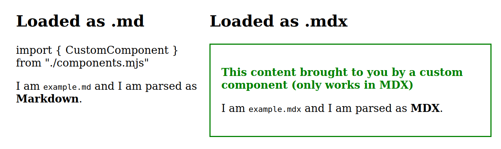

# Minimap reproduction repo for a MDX loader problem with  `.md` files

So it seems that no matter what I do, I cannot get the MDX loader to treat
`.md` files like MDX, instead merely loading them as Markdown.

The same setup loads `.mdx` files just fine and does corretly treat them as
MDX.

The relevant NextJS config is:

```js
const configuration = {
  pageExtensions: ["mjs"],
  webpack(config, options) {
    config.module.rules.push({
      test: /\.mdx?$/,
      use: [
        options.defaultLoaders.babel,
        {
          loader: "@mdx-js/loader",
          /** @type {import('@mdx-js/loader').Options} */
          options: {
            /* jsxImportSource: …, otherOptions… */
          },
        },
      ],
    });

    return config;
  },
};
```

Note this line that tells webback to treat both `.md` and `.mdx` files the
same:

```js
      test: /\.mdx?$/,
```

Alas, it does not work and I can't figure out why. This is the result:



As you can see, the file on the left is loaded as markdown. The one on the right as MDX.
They are loaded as such:

```js
import MD from '../mdx/example.md'
import MDX from '../mdx/example.mdx'
```

I have no idea why it doesn't treat both of them as MDX. So I have created this
minimal repo in the hope somebody will be able to help out.

